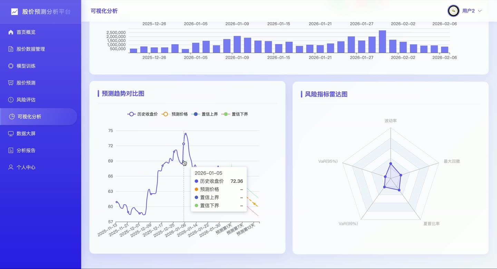
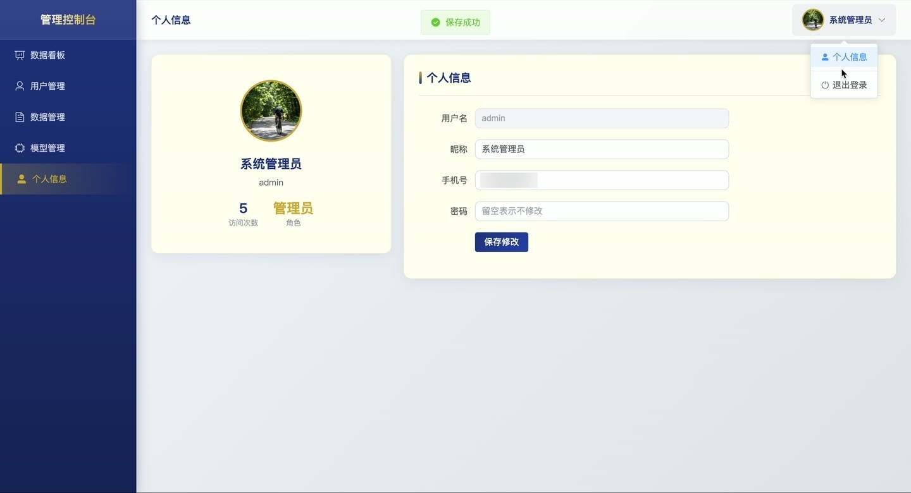
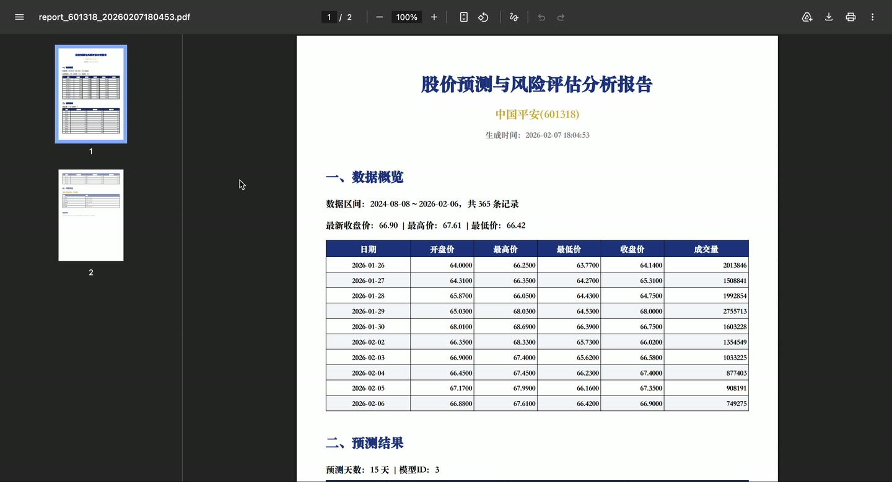
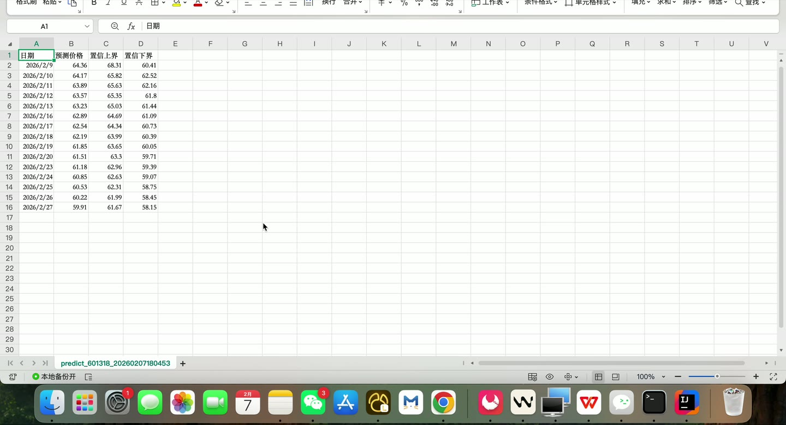
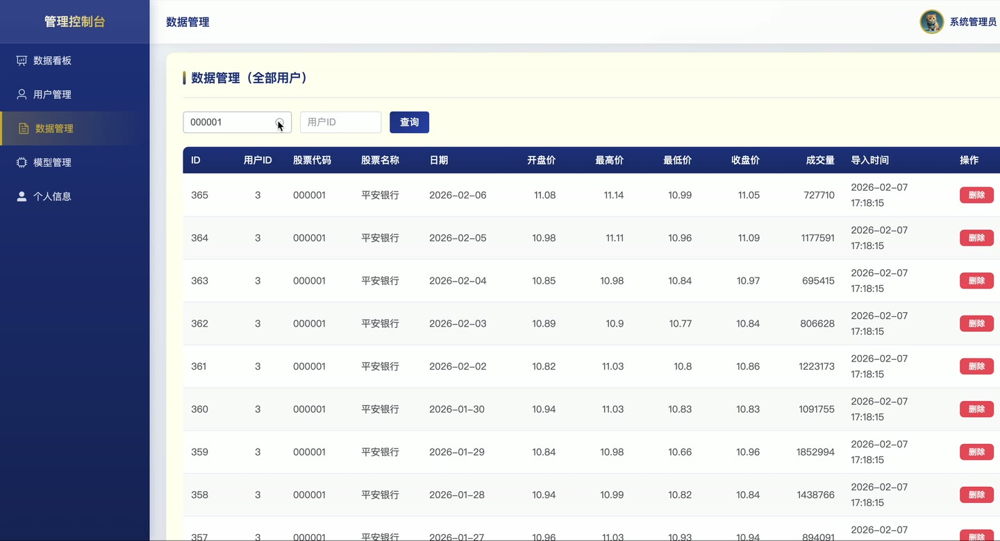

# (附文档)Python+深度学习+PyTorch 基于大数据分析的股价风险评估和预测系统

**技术栈**：Python、Django、PyTorch、深度学习、Vue3、MySQL

### 系统简介

本系统是一套基于深度学习与大数据的股价风险评估和预测平台，采用前后端分离架构。后端基于 Django 提供 REST 接口并调度 PyTorch 训练与预测脚本，前端基于 Vue3 构建用户端与管理端两套界面，数据存储于 MySQL。系统包含普通用户与管理员两类角色，覆盖股价数据管理、模型训练、股价预测、风险评估、分析报告与数据可视化全流程。
 
### 核心功能
 
### 普通用户端

- 注册与登录：填写用户名、密码完成注册，使用账号密码登录并获取 token 与用户信息。

- 首页概览：查看股价数据、训练模型、预测记录、风险评估四项统计卡片，并展示已持有的股票代码标签。

- 快捷操作入口：一键跳转导入数据、训练模型、股价预测、风险评估、可视化、生成报告等页面。

- 股价数据管理：分页查看本人股价数据列表，支持按股票代码筛选、按股票代码批量删除、删除单条数据。

- CSV 数据导入：上传 CSV 文件批量导入开盘、最高、最低、收盘、成交量等字段的股价数据。

- CSV 数据导出：将本人股价数据导出为 CSV 文件下载。

- 股票代码列表：查询本人已导入的全部股票代码与名称，供预测和可视化选择。

- 模型训练：选择 LSTM 或 Transformer 模型类型，设置训练轮数、序列长度、学习率后提交训练任务。

- 模型列表：分页查看本人训练模型，展示模型名称、类型、股票代码、轮数、训练损失、验证损失与训练状态。

- 模型详情与删除：查看单个模型详情，删除不再需要的模型记录。

- 股价预测：选择已完成的模型，指定预测天数（7/15/30 天）发起预测，生成未来收盘价序列。

- 预测结果展示：查看预测价格、置信区间上界与下界，并以图表形式展示走势。

- 预测记录管理：分页查看历史预测记录，查看单条预测详情，删除预测记录。

- 风险评估：对指定股票发起风险评估，计算 VaR(95%)、VaR(99%)、波动率、夏普比率、最大回撤与风险等级。

- 风险评估列表：分页查看本人评估记录，查看评估详情与详细评估数据，删除评估记录。

- 分析报告生成：关联预测记录与风险评估，一键生成包含 PDF 报告与 CSV 预测数据的分析报告。

- 报告管理：分页查看报告列表，查看报告详情，下载 PDF 报告文件，删除报告。

- 可视化分析：以图表形式展示股价走势、模型训练情况与风险分布等多维数据。

- 数据大屏：全屏展示数据资产概览、模型训练状态分布、风险等级分布、股价走势全景图、预测准确度趋势、成交量波动分析、核心风险指标雷达图、预测收益分析与实时数据滚动动态。

- 个人中心：查看与修改昵称、手机号、密码，上传并更换头像。
 
### 管理员端

- 管理员登录：使用管理员账号密码通过独立入口登录后台控制台。

- 数据看板：查看总用户、普通用户、管理员、训练模型、预测记录、分析报告等统计卡片。

- 用户注册趋势：以折线图展示近 7 天新增用户数量变化。

- 活跃用户排行：以表格展示访问次数 Top10 的用户昵称与访问次数。

- 用户管理：分页查看全部用户，支持按用户名/昵称关键字与角色筛选。

- 新增用户：填写用户名、密码、昵称、手机号、角色、头像新增用户账号。

- 编辑用户：修改用户昵称、手机号、角色、头像，密码留空则不修改。

- 删除用户：删除指定用户账号。

- 数据管理：分页查看全部用户的股价数据，支持按股票代码与用户 ID 筛选。

- 数据删除：删除任意一条股价数据记录。

- 模型管理：分页查看全部用户的训练模型，支持按模型类型与股票代码筛选。

- 模型删除：删除指定模型记录。

- 个人信息维护：查看与修改管理员昵称、手机号、密码，上传更换头像。
 
### 技术栈

后端框架Django
深度学习框架PyTorch（LSTM、Transformer）
数据处理NumPy、Pandas、scikit-learn（MinMaxScaler）
ORMDjango ORM
权限控制基于角色字段（0 普通用户 / 1 管理员）与前端路由守卫
前端框架Vue3
UI 组件库Element Plus
状态管理Pinia（user store）
构建工具Vite
路由Vue Router（前端路由 + SPA 转发）
图表库ECharts
数据库MySQL
接口风格RESTful API（统一响应结构）
 
### 交付内容

- 后端完整源码

- 前端完整源码

- 数据库初始化脚本

- 万字文档

## 界面展示

---

## 获取完整源码 + 万字文档

本仓库为项目介绍页。**完整前后端源码、数据库初始化脚本、万字项目文档**，请加微信 `kangkangcode`，或访问 [codekk.top](http://codekk.top) 获取。

可作课程设计 / 毕业设计参考，支持远程部署调试。